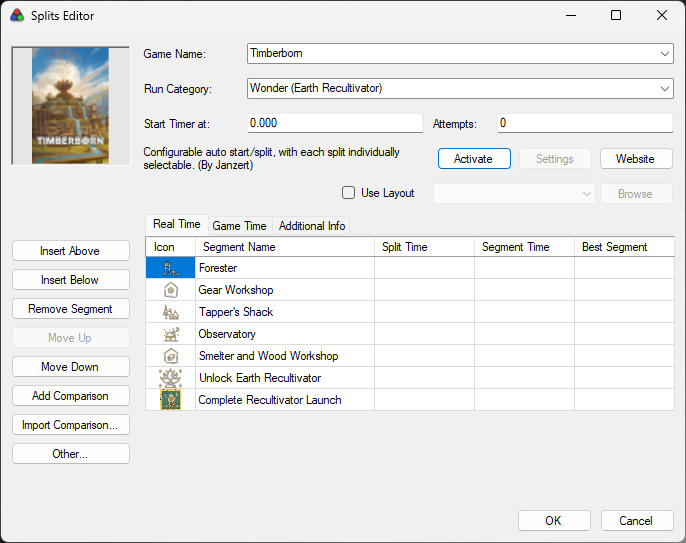
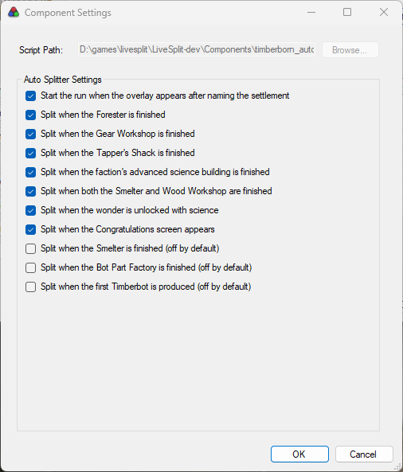

# Timberborn Auto Splitter

A LiveSplit auto splitter for
[Timberborn](https://store.steampowered.com/app/1062090/Timberborn/), built for
the sandboxed WebAssembly auto splitting runtime. This work was inspired by
[MHVandborg's autosplitter](https://github.com/MHVandborg/timberborn_speedrun/tree/master)
which uses a game mod to collect the split information.

For this autosplitter **nothing runs inside the game.** It reads state directly
from the game's memory, so it works on a stock, unmodified game.

It is **development stable**: every split works and is verified on both
factions, against real runs replayed from captured game memory as well as
played through live. What it has not yet had is widespread use, which is the
only thing between here and calling it stable outright — so feedback,
especially from a run that went wrong, is worth a great deal.


## Setup

Nothing to build, and no module to download: LiveSplit carries a list of auto
splitters and fetches this one itself. All you need is a splits file.
[`examples/`](examples/) has one per category (and per faction for the wonder
run) plus a layout to start from. [`CHANGELOG.md`](CHANGELOG.md) says what
changed if you are updating from an earlier one.

1. From the [latest release](https://github.com/Janzert/timberborn_autosplitter/releases/latest),
   download the splits file for what you run —
   [`Timberborn-Wonder-Folktails.lss`](https://github.com/Janzert/timberborn_autosplitter/releases/latest/download/Timberborn-Wonder-Folktails.lss),
   [`Timberborn-Wonder-IronTeeth.lss`](https://github.com/Janzert/timberborn_autosplitter/releases/latest/download/Timberborn-Wonder-IronTeeth.lss)
   or
   [`Timberborn-Timberbot.lss`](https://github.com/Janzert/timberborn_autosplitter/releases/latest/download/Timberborn-Timberbot.lss)
   — and, if you want the layout these were designed against,
   [`Timberborn.lsl`](https://github.com/Janzert/timberborn_autosplitter/releases/latest/download/Timberborn.lsl).
2. In LiveSplit, right-click → **Open Splits** → **From File...** and pick the
   `.lss`. Then right-click → **Open Layout** → **From File...** and pick the
   `.lsl`.

   
3. Right-click → **Edit Splits...**. The auto splitter is at the bottom of that
   dialog, found by the game name. Press **Activate**.

   

   **That is the only step you have to remember.** LiveSplit downloads the
   splitter, switches it on, and records that Timberborn's auto splitter is
   active — so from then on, opening a splits file whose game name is
   **Timberborn** is the whole procedure.
4. Still in **Edit Splits**, **Settings** shows the individual splits. Each
   splits file above already has its own category ticked, so there is nothing
   to change unless your route differs — [The splits](#the-splits) below says
   what each one does. **OK**, then **Save Splits** if you changed anything.

   

**It updates itself.** LiveSplit re-fetches the current release every time the
splitter activates, so a new version arrives on its own and there is no file to
replace. The **Script Path** box in those settings is greyed out for that
reason, and shows where LiveSplit put the download rather than anything you
need to set. The flip side is that you always get the newest release — if you
need a specific build, see [Building](#building).

Which splits are on is stored in the **splits file**, so each `.lss` carries its
own configuration and switching categories is just opening a different one.
Whether the splitter is active at all is remembered by LiveSplit itself, per
game name, rather than in either file.

The Auto Splitting Runtime that runs the module ships with LiveSplit itself —
tested against 1.8.29 and 1.8.34 — so there is nothing else to install, and
nothing is added to the game.

There is a wonder splits file for each faction, because the segment names and
icons are the faction's own: the Iron Teeth one has the Numbercruncher and the
Earth Repopulator where the Folktails one has the Observatory and the Earth
Recultivator. The other five segments are the same either way, as are the
splitter and the layout — only the `.lss` differs. The Timberbot file is one for
both factions, since none of its four segments is a faction specific building.

Order the splits to match the route **you** run rather than the order they are
listed in: each fires when you achieve it, so a `.lss` ordered the way you
actually play keeps every split attributed to the right segment.

Already have a layout you like? Keep it. The splitter is not part of the
layout at all — the only thing the example `.lsl` adds is the status line
below, and that is one component you can add to your own.

### The status line

The example layout carries a **Text** component just below the split list that
is blank almost all the time. It is how the splitter says something went wrong.

It only ever shows warnings — a run start it could not time, or a game version
it cannot read. In normal use it stays empty, so anything appearing there is
worth reading:

| Message | What it means |
|---|---|
| `Run start missed` | A new game was loading, but the splitter bound to it too late to catch the start. Start the timer yourself; your other splits still work. |
| `Game already in progress` | The splitter attached to a game that was already running, so there was no start for it to see. Start the timer yourself; your other splits still work. |
| `Game version not supported: DayNumber missing` | A game update renamed something the splitter cannot do without. |
| `Game version may not be supported -- see the log` | Some names did not resolve. Some splits may still work. |
| `Cannot tell a new game from a loaded save` | The splitter cannot rule out starting the timer on a loaded save. |

To add it to a layout of your own: **Edit Layout...** → `+` → **Information**
→ **Text**, then in its settings tick **Custom Variable**, put
`Timberborn Autosplitter` in the variable-name box, and leave the other text
box empty so the row is blank when there is nothing to say. It reads best
directly under the splits — the row keeps its height even when empty, and a gap
there is less conspicuous than one between the title and the first split.

This never touches your splits file. LiveSplit only writes custom variables to
a `.lss` if they were made permanent in the Run Editor, and one set by an auto
splitter is not — it does not even mark your splits as needing saving.

## The splits

The wonder run is seven splits, a new game through to the Congratulations
screen — the same set MHVandborg's splitter defines:

| Split | Fires when |
|---|---|
| *(run start)* | the overlay appears after naming the settlement |
| Forester | a Forester is built |
| Gear Workshop | a Gear Workshop is built |
| Tapper's Shack | a Tapper's Shack is built |
| Observatory / Numbercruncher | the faction's advanced science building is built (Observatory for Folktails, Numbercruncher for Iron Teeth) |
| Smelter + Wood Workshop | both are built, in either order |
| Wonder Unlocked | the faction's wonder is unlocked in the science tree |
| Congratulations screen *(run end)* | the Congratulations screen appears |

Both factions are covered: where they have faction specific buildings — the
advanced science building and the wonder itself — one split covers both, and
only the one belonging to the faction being played can fire.

Three more triggers cover a **Timberbot** run, which ends at the first bot
rather than at a wonder. They are **off by default**, and the Timberbot splits
file turns them on for you:

| Split | Fires when |
|---|---|
| *(run start)* | the overlay appears after naming the settlement |
| Gear Workshop | a Gear Workshop is built *(the same checkbox as above)* |
| Smelter | a Smelter is built |
| Bot Part Factory | a Bot Part Factory is built |
| Produce a Timberbot *(run end)* | the first bot is created — the moment the population overlay starts showing a bot count |

There is no category to choose: every trigger is a checkbox and you turn on
whichever ones you actually split on, mixing them however your route goes.

Two of them are worth a sentence each:

- **Smelter** and **Smelter + Wood Workshop** read the same building. The first
  splits when the Smelter is finished; the second waits for the Wood Workshop
  as well and fires on whichever is second. Leaving both on gives you two
  splits out of one Smelter, which is why the solo one ships off.
- A Timberbot run means turning the wonder splits **off** as well as turning
  these on — nothing else stops the Observatory or Numbercruncher from
  splitting if you build one on the way to bots. The Timberbot splits file
  already does both; it only matters if you are configuring one yourself.

One LiveSplit limitation worth noting: **Splits fire in whatever order the
player achieves them**, which need not match the order in a `.lss` file. So an
out of order split will get attributed to the wrong item.

See [docs/DESIGN.md](docs/DESIGN.md) for how it works and what has been
measured.

## Building

Only needed to work on it — see [Setup](#setup) to just use it.

```bash
git clone --recurse-submodules https://github.com/Janzert/timberborn_autosplitter.git
cargo wasm
```

`cargo wasm` is an alias for `cargo build --release --target
wasm32-unknown-unknown`, defined in `.cargo/config.toml`. The wasm target is
deliberately not the default: a default target applies to every cargo command,
not just `build`, which stopped `cargo test` from running at all and made
`cargo install` quietly produce a wasm binary. Ordinary commands therefore
build for the host, and the artifact that ships is the one spelled out.

If you cloned without `--recurse-submodules`, you will need to get the
submodule with:

```bash
git submodule update --init --recursive
```

The output is `target/wasm32-unknown-unknown/release/timberborn_autosplitter.wasm`.

To run *that* rather than the release LiveSplit downloads, add the runtime to a
layout by hand — right-click → **Edit Layout...** → `+` → **Control** → **Auto
Splitting Runtime**, then **Browse...** to the file. A component added this way
takes its path from the layout and ignores the auto splitter list entirely, so
**deactivate the downloaded one in Edit Splits first** or both will run. Note
that its settings then live in the `.lsl` rather than the `.lss`, which is why
this is the development route and not the one above.

[asr-debugger](https://github.com/LiveSplit/asr-debugger) is the quicker loop
still, with a log pane and no LiveSplit in the way.

### Tests

```bash
cargo test
```

Runs against the host, with no game and no wasm involved: `test-harness/`
provides a fake auto splitting runtime, so the splitter can be driven and
inspected directly.

Most of it builds a whole synthetic Mono process out of the committed layout
facts in `fixtures/` — up to and including whole runs of both categories, the
timer starting and every split firing, and the awkward edges of a session: the
game starting after the splitter, closing under it, or being the second game of
the evening. All in a twentieth of a second, on a machine that has never had
Timberborn installed. See [fixtures/README.md](fixtures/README.md).

Tests that need captured game memory are behind a feature, so `cargo test`
neither compiles nor counts them:

```bash
cargo snapshot-tests
```

Those replay real captures and recordings, including whole runs — the timer
starting and every split firing, offline — and compare the synthetic world
against a capture class by class, which is what keeps a fixture honest. They
need captures this repo does not ship; a missing one fails with the steps for
making it. See [snapshots/README.md](snapshots/README.md).

[docs/TESTING.md](docs/TESTING.md) covers how the two fit together, and — worth
reading before trusting either — what they do not catch.

## Layout

| Path | |
|---|---|
| `src/` | the auto splitter |
| `vendor/asr` | submodule; see [docs/ASR_FORK.md](docs/ASR_FORK.md) |
| `devtools/` | offline development tooling — never shipped, never runs against the game |
| `docs/TESTING.md` | how the two test suites fit together, and what they do not catch |
| `test-harness/` | a fake auto splitting runtime, so the splitter can be tested without the game |
| `tests/` | those tests |
| `tb-record/` | records a run against the live game, so replaying it can test that splits fire |
| `tb-fixture/` | writes a fixture from an install and a snapshot |
| `fixtures/` | the game's layout as committed facts; see [fixtures/README.md](fixtures/README.md) |
| `tb-ptrace-open/` | the one binary needing a capability, so no other one does |
| `snapshots/` | captured game memory, never committed; see [snapshots/README.md](snapshots/README.md) |

## devtools

`devtools/metadata.py` reads .NET metadata straight out of the game's
assemblies — no mod, no running game, no mono or ilspy, just the ECMA-335
tables parsed directly.

```bash
./devtools/metadata.py check ~/.steam/steam/steamapps/common/Timberborn/Timberborn_Data/Managed
```

That checks every class and field name `src/probe.rs` depends on against an
install, which is the offline half of the version check — the fast answer to
"did an update rename something", with the game closed. `facts` emits the same
set as JSON, which is half of a fixture. `dump <assembly.dll>`
lists every class and field in an assembly, with each field's declared type,
which is how the split sources in [docs/DESIGN.md](docs/DESIGN.md) were found.

Nothing here is distributed to runners or touches a running game. See
[devtools/README.md](devtools/README.md).

## Linux notes

LiveSplit has to run **inside the game's Proton prefix**, not in one of its
own. Reads of another process's memory are served by that prefix's
`wineserver`, and a `wineserver` only knows the processes belonging to it — so
a LiveSplit started separately can see the game running but never read it, and
the splitter waits forever for a process it cannot attach to.

## License

MIT — see [LICENSE](LICENSE). The vendored asr submodule is separately
licensed; see `vendor/asr`.
