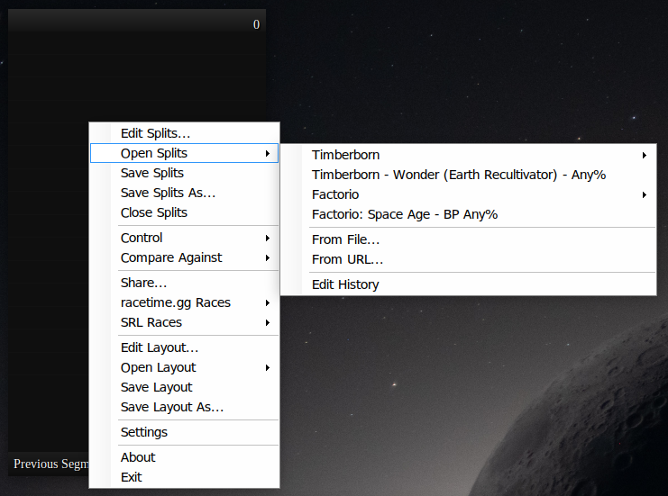
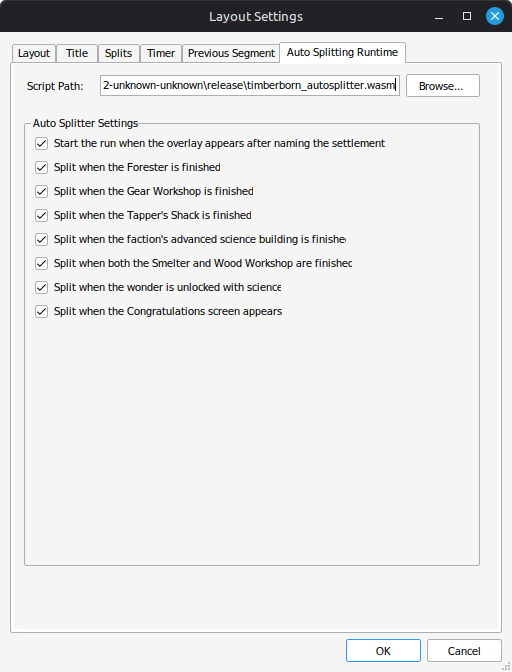
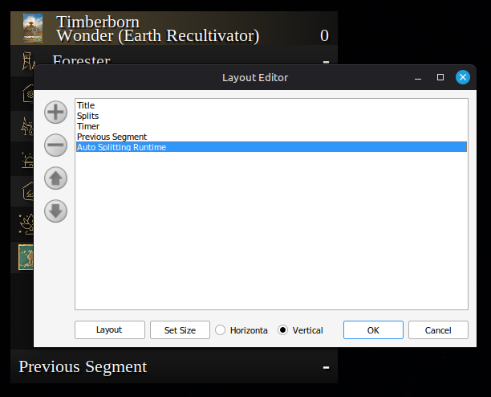

# Timberborn Auto Splitter

A LiveSplit auto splitter for
[Timberborn](https://store.steampowered.com/app/1062090/Timberborn/), built for
the sandboxed WebAssembly auto splitting runtime. This work was inspired by
[MHVandborg's autosplitter](https://github.com/MHVandborg/timberborn_speedrun/tree/master)
which uses a game mod to collect the split information.

For this autosplitter **nothing runs inside the game.** It reads state directly
from the game's memory, so it works on a stock, unmodified game.


## Status

Currently this is barely beyond prototype stage in a minimally working state.
Any feedback would certainly be appreciated, but be cautious if using this in
an actual run.

All seven splits defined by MHVandborg's splitter work, new game start to the
"Congratulations!" screen. Verified on both factions: a complete Folktails run,
and every split condition on Iron Teeth:

| Split | Fires when |
|---|---|
| *(run start)* | the overlay appears after naming the settlement |
| Forester | a Forester is built |
| Gear Workshop | a Gear Workshop is built |
| Tapper's Shack | a Tapper's Shack is built |
| Observatory / Numbercruncher | the faction's advanced science building is built (Observatory for Folktails, Numbercruncher for Iron Teeth) |
| Smelter + Wood Workshop | both are built, in either order |
| Wonder Unlocked | the faction's wonder is unlocked in the science tree |
| Congratulations screen *(run end)* | the Congratulations screen appears |

Both factions are covered: where they have faction specific buildings — the
advanced science building and the wonder itself — one split covers both, and
only the one belonging to the faction being played can fire.

One LiveSplit limitation worth noting: **Splits fire in whatever order the
player achieves them**, which need not match the order in a `.lss` file. So an
out of order split will get attributed to the wrong item.

See [docs/DESIGN.md](docs/DESIGN.md) for how it works and what has been
measured.

## Setup

No build needed to try it — the release carries a prebuilt module, and
[`examples/`](examples/) has a splits file and a layout to start from.
[`CHANGELOG.md`](CHANGELOG.md) says what changed if you are updating from an
earlier one.

1. From the [latest release](https://github.com/Janzert/timberborn_autosplitter/releases/latest),
   download
   [`timberborn_autosplitter.wasm`](https://github.com/Janzert/timberborn_autosplitter/releases/latest/download/timberborn_autosplitter.wasm),
   and the two example files:
   [`Timberborn-Wonder-Folktails.lss`](https://github.com/Janzert/timberborn_autosplitter/releases/latest/download/Timberborn-Wonder-Folktails.lss)
   and
   [`Timberborn.lsl`](https://github.com/Janzert/timberborn_autosplitter/releases/latest/download/Timberborn.lsl).
2. In LiveSplit, right-click → **Open Splits** → **From File...** and pick the
   `.lss`. Then right-click → **Open Layout** → **From File...** and pick the
   `.lsl`, which already has the **Auto Splitting Runtime** component in it.

   
3. Right-click → **Edit Layout...**, then double-click **Auto Splitting
   Runtime** in the component list. Use **Browse...** next to **Script Path**
   to pick the `.wasm` you downloaded. (The **Layout Settings** button and its
   **Auto Splitting Runtime** tab reach the same place.)
4. The individual splits appear as checkboxes below it and can be turned off
   there. **Save Layout** and **Save Splits** when done.

   

The layout ships with **Script Path** deliberately empty, because the path is
stored in the layout and only you know where you put the file. For the same
reason, moving the `.wasm` afterwards breaks it until you browse to it again. A
relative path is resolved against LiveSplit's own working directory rather than
the layout's, so it only works if the `.wasm` sits next to `LiveSplit.exe`.

The Auto Splitting Runtime component ships with LiveSplit itself — this was
tested against 1.8.29 — so there is nothing else to install, and nothing is
added to the game.

The example splits are for a **Folktails** run: the segment names and icons
are that faction's, so an Iron Teeth run wants its own file, with the
Numbercruncher and the Earth Repopulator in place of the Observatory and the
Earth Recultivator. The layout is faction-neutral either way.

Order the seven splits to match the route **you** run rather than the order
they are listed in: each fires when you achieve it, so a `.lss` ordered the
way you actually play keeps every split attributed to the right segment.

### Adding the auto splitter to your own layout

Already have a layout you like? Skip the example `.lsl` and add the component
to yours instead: right-click → **Edit Layout...** → `+` → **Control** →
**Auto Splitting Runtime**, then step 3 above.



### The status line

The example layout carries a **Text** component just below the split list that
is blank almost all the time. It is how the splitter says something went wrong.

It only ever shows warnings — a run start it could not time, or a game version
it cannot read. In normal use it stays empty, so anything appearing there is
worth reading:

| Message | What it means |
|---|---|
| `Run start missed` | A new game was loading, but the splitter bound to it too late to catch the start. Start the timer yourself; your other splits still work. |
| `Game already in progress` | The splitter attached to a game that was already running, so there was no start for it to see. Start the timer yourself; your other splits still work. |
| `Game version not supported: DayNumber missing` | A game update renamed something the splitter cannot do without. |
| `Game version may not be supported -- see the log` | Some names did not resolve. Some splits may still work. |
| `Cannot tell a new game from a loaded save` | The splitter cannot rule out starting the timer on a loaded save. |

To add it to a layout of your own: **Edit Layout...** → `+` → **Information**
→ **Text**, then in its settings tick **Custom Variable**, put
`Timberborn Autosplitter` in the variable-name box, and leave the other text
box empty so the row is blank when there is nothing to say. It reads best
directly under the splits — the row keeps its height even when empty, and a gap
there is less conspicuous than one between the title and the first split.

This never touches your splits file. LiveSplit only writes custom variables to
a `.lss` if they were made permanent in the Run Editor, and one set by an auto
splitter is not — it does not even mark your splits as needing saving.

## Building

Only needed to work on it — see [Setup](#setup) to just use it.

```bash
git clone --recurse-submodules https://github.com/Janzert/timberborn_autosplitter.git
cargo build --release
```

If you cloned without `--recurse-submodules`, you will need to get the
submodule with:

```bash
git submodule update --init --recursive
```

The output is `target/wasm32-unknown-unknown/release/timberborn_autosplitter.wasm`.
Point LiveSplit's Auto Splitting Runtime component at it, or use
[asr-debugger](https://github.com/LiveSplit/asr-debugger) while developing.

## Layout

| Path | |
|---|---|
| `src/` | the auto splitter |
| `vendor/asr` | submodule; see [docs/ASR_FORK.md](docs/ASR_FORK.md) |
| `devtools/` | offline development tooling — never shipped, never runs against the game |

## devtools

`devtools/metadata.py` reads .NET metadata straight out of the game's
assemblies — no mod, no running game, no mono or ilspy, just the ECMA-335
tables parsed directly.

```bash
./devtools/metadata.py check ~/.steam/steam/steamapps/common/Timberborn/Timberborn_Data/Managed
```

That checks every class and field name `src/probe.rs` depends on against an
install, which is the offline half of the version check — the fast answer to
"did an update rename something", with the game closed. `dump <assembly.dll>`
lists every class and field in an assembly, with each field's declared type,
which is how the split sources in [docs/DESIGN.md](docs/DESIGN.md) were found.

Nothing here is distributed to runners or touches a running game. See
[devtools/README.md](devtools/README.md).

## Linux notes

LiveSplit has to run **inside the game's Proton prefix**, not in one of its
own. Reads of another process's memory are served by that prefix's
`wineserver`, and a `wineserver` only knows the processes belonging to it — so
a LiveSplit started separately can see the game running but never read it, and
the splitter waits forever for a process it cannot attach to.

## License

MIT — see [LICENSE](LICENSE). The vendored asr submodule is separately
licensed; see `vendor/asr`.
